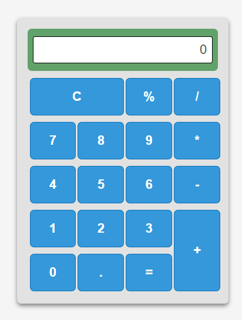

# challenge.calculadora

Uma aplicação de calculadora construída com **React**, utilizando **styled-components** para estilização e **CSS Grid** para layout responsivo.

> _A calculator application built with React, using styled-components for styling and CSS Grid for responsive layout._



---

## 📋 Descrição / Description

Esta aplicação é uma calculadora funcional que demonstra os conceitos fundamentais do React, incluindo componentização, gerenciamento de estado e passagem de props para customização de componentes.

> _This application is a fully functional calculator that demonstrates fundamental React concepts, including componentization, state management, and props passing for component customization._

---

## 🛠️ Stacks Utilizadas / Used Stacks

Aqui vai um resumo das tecnologias que usei neste projeto:

> Here is a summary of the technologies I used in this project:

- **React**: O coração da aplicação, para criar componentes interativos. `The heart of the application, to create interactive components.`
- **React DOM**: Para renderizar tudo no navegador. `To render everything in the browser.`
- **Styled Components**: Para dar estilo aos componentes de forma elegante. `To style the components elegantly.`
- **Testing Library**: Incluindo Jest e outras ferramentas para testar se tudo funciona. `Including Jest and other tools to test if everything works.`
- **Web Vitals**: Para medir o desempenho da app. `To measure the app's performance.`
- **Create React App**: O boilerplate que facilitou o setup inicial. `The boilerplate that facilitated the initial setup.`

Foi uma diversão montar isso tudo! 🚀

> It was fun to build all this! 🚀

## 📊 Status do Projeto / Project Status

**Concluído!** ✅ Tudo funcionando perfeitamente. A calculadora calcula, os botões clicam, e o layout fica bem em qualquer tela.

> **Completed!** ✅ Everything working perfectly. The calculator calculates, the buttons click, and the layout looks good on any screen.

---

## 🧩 Funcionalidades Principais / Main Features

### 1. Componentização / Componentization

A aplicação foi construída utilizando o paradigma de **componentização** do React, que permite dividir a interface em partes reutilizáveis e independentes.

_The application was built using React's **componentization** paradigm, which allows dividing the interface into reusable and independent parts._

#### Estrutura de Componentes / Component Structure

```
src/
├── App.js              # Componente principal / Main component
├── index.js            # Ponto de entrada / Entry point
├── styles.js           # Styled components de layout / Layout styled components
├── global.js           # Estilos globais / Global styles
└── components/
    ├── Button/
    │   ├── index.js    # Componente Button reutilizável / Reusable Button component
    │   └── styles.js   # Estilos do Button / Button styles
    └── Input/
        ├── index.js    # Componente Input para display / Display Input component
        └── styles.js   # Estilos do Input / Input styles
```

#### Componentes Criados / Created Components

| Componente / Component | Descrição / Description                                                                                                       | Arquivo / File                   |
| ---------------------- | ----------------------------------------------------------------------------------------------------------------------------- | -------------------------------- |
| `App`                  | Componente principal que gerencia o estado e a lógica da calculadora / Main component that manages calculator state and logic | `src/App.js`                     |
| `Button`               | Botão reutilizável customizável via props / Reusable button customizable via props                                            | `src/components/Button/index.js` |
| `Input`                | Campo de display que mostra o valor atual / Display field showing current value                                               | `src/components/Input/index.js`  |
| `Container`            | Container principal com flexbox / Main container with flexbox                                                                 | `src/styles.js`                  |
| `Content`              | Área de conteúdo da calculadora / Calculator content area                                                                     | `src/styles.js`                  |
| `Row`                  | Grid layout para os botões / Grid layout for buttons                                                                          | `src/styles.js`                  |

---

### 2. Passagem de Parametrização para Customizar Botões / Props Passing to Customize Buttons

O componente `Button` é o principal exemplo de reutilização e customização via **props** no React. Um único componente é capaz de renderizar todos os botões da calculadora com diferentes aparências e comportamentos.

_The `Button` component is the main example of reuse and customization via **props** in React. A single component is capable of rendering all calculator buttons with different appearances and behaviors._

#### Props Disponíveis / Available Props

| Prop         | Tipo / Type        | Descrição / Description                                           | Exemplo / Example                     |
| ------------ | ------------------ | ----------------------------------------------------------------- | ------------------------------------- |
| `label`      | `string`           | Texto exibido no botão / Text displayed on the button             | `label="7"`                           |
| `onClick`    | `function`         | Função executada ao clicar / Function executed on click           | `onClick={() => handleAddValue("7")}` |
| `gridColumn` | `string \| number` | Posição/extentão na coluna do grid / Column position/span in grid | `gridColumn="1 / 3"`                  |
| `gridRow`    | `string \| number` | Posição/extentão na linha do grid / Row position/span in grid     | `gridRow={1}`                         |

#### Exemplos de Customização / Customization Examples

```jsx
// Botão que ocupa 2 colunas (botão "C" - Clear)
// Button that spans 2 columns ("C" - Clear button)
<Button
  label="C"
  gridColumn="1 / 3"
  gridRow={1}
  onClick={() => handleClear()}
/>

// Botão numérico padrão (ex: "7")
// Standard numeric button (e.g., "7")
<Button
  label="7"
  gridColumn={1}
  gridRow={2}
  onClick={() => handleAddValue("7")}
/>

// Botão de operação (ex: "+")
// Operation button (e.g., "+")
<Button
  label="+"
  gridColumn={4}
  gridRow="4 / 6"
  onClick={() => handleOperation("+")}
/>
```

#### Implementação do Componente Button / Button Component Implementation

```jsx
// src/components/Button/index.js
import { ButtonContainer } from "./styles";

const Button = ({ label, onClick, ...props }) => {
  return (
    <ButtonContainer {...props} onClick={onClick}>
      {label}
    </ButtonContainer>
  );
};

export default Button;
```

O **spread operator** `{...props}` permite que qualquer prop adicional (como `gridColumn` e `gridRow`) seja automaticamente repassado para o `styled-component`, que então aplica os estilos condicionais:

_The **spread operator** `{...props}` allows any additional props (like `gridColumn` and `gridRow`) to be automatically passed to the styled-component, which then applies conditional styling:_

```javascript
// src/components/Button/styles.js
${props => props.gridColumn && `grid-column: ${props.gridColumn};`}
${props => props.gridRow && `grid-row: ${props.gridRow};`}
```

---

## 🛠️ Tecnologias Utilizadas / Technologies Used

### Ferramentas / Tools

- ✅ VSCode
- ✅ Node.js e NPM
- ✅ Yarn

### Dependências Principais / Main Dependencies

| Dependência / Dependency | Versão / Version | Finalidade / Purpose                               |
| ------------------------ | ---------------- | -------------------------------------------------- |
| `react`                  | ^19.2.4          | Biblioteca principal para UI / Main UI library     |
| `react-dom`              | ^19.2.4          | Renderização do DOM / DOM rendering                |
| `styled-components`      | ^6.3.12          | CSS-in-JS para estilização / CSS-in-JS for styling |

### Dependências de Desenvolvimento / Dev Dependencies

| Dependência / Dependency | Finalidade / Purpose                                                  |
| ------------------------ | --------------------------------------------------------------------- |
| `@testing-library/react` | Testes de componentes React / React component testing                 |
| `react-scripts`          | Scripts de build do Create React App / Create React App build scripts |

---

## 🚀 Como Executar / How to Run

### Pré-requisitos / Prerequisites

- Node.js instalado / Node.js installed
- Yarn ou NPM instalado / Yarn or NPM installed

### Instalação / Installation

```bash
# Instalar dependências / Install dependencies
yarn install
# ou / or
npm install
```

### Desenvolvimento / Development

```bash
# Iniciar servidor de desenvolvimento / Start development server
yarn start
# ou / or
npm start
```

### Build de Produção / Production Build

```bash
# Gerar build otimizado / Generate optimized build
yarn build
# ou / or
npm run build
```

---

## 🧮 Funcionalidades da Calculadora / Calculator Features

| Operação / Operation | Descrição / Description                                 |
| -------------------- | ------------------------------------------------------- |
| `+`                  | Adição / Addition                                       |
| `-`                  | Subtração / Subtraction                                 |
| `*`                  | Multiplicação / Multiplication                          |
| `/`                  | Divisão / Division                                      |
| `%`                  | Módulo (resto da divisão) / Modulo (division remainder) |
| `C`                  | Limpar tudo / Clear all                                 |
| `.`                  | Ponto decimal / Decimal point                           |
| `=`                  | Calcular resultado / Calculate result                   |

---

## 📂 Estrutura do Projeto / Project Structure

```
challenge.calculadora/
├── public/
│   └── index.html          # Template HTML principal / Main HTML template
├── src/
│   ├── components/
│   │   ├── Button/
│   │   │   ├── index.js    # Componente Button / Button component
│   │   │   └── styles.js   # Estilos do Button / Button styles
│   │   └── Input/
│   │       ├── index.js    # Componente Input / Input component
│   │       └── styles.js   # Estilos do Input / Input styles
│   ├── App.js              # Componente principal / Main component
│   ├── global.js           # Estilos globais / Global styles
│   ├── index.js            # Ponto de entrada / Entry point
│   └── styles.js           # Styled components de layout / Layout styled components
├── package.json            # Dependências e scripts / Dependencies and scripts
└── README.md               # Documentação do projeto / Project documentation
```

---

## 📚 Conceitos Demonstrados / Concepts Demonstrated

1. **Componentização**: Divisão da UI em componentes reutilizáveis
   _Componentization: Dividing UI into reusable components_

2. **Estado com Hooks**: Uso de `useState` para gerenciar dados
   _State with Hooks: Using `useState` to manage data_

3. **Props**: Passagem de dados entre componentes pai e filho
   _Props: Passing data between parent and child components_

4. **Event Handling**: Tratamento de cliques e interações do usuário
   _Event Handling: Handling user clicks and interactions_

5. **CSS Grid**: Layout responsivo com grid CSS
   _CSS Grid: Responsive layout with CSS Grid_

6. **Styled Components**: Estilização com CSS-in-JS
   _Styled Components: Styling with CSS-in-JS_
