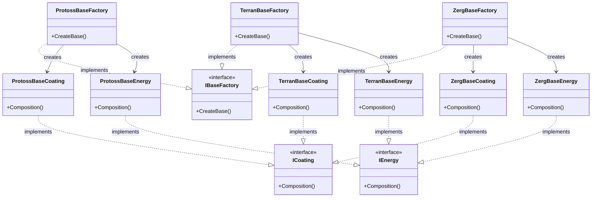

# Abstract Factory Design Pattern Implementation

This project demonstrates the Abstract Factory design pattern in C#, using a StarCraft-inspired theme where different races (Protoss, Terran, Zerg) build bases with unique coatings and energy systems.

## Overview

The Abstract Factory pattern provides an interface for creating families of related or dependent objects without specifying their concrete classes.

In this implementation:

- **IBaseFactory**: Abstract factory interface for creating bases.
- **ICoating**: Interface for base coatings.
- **IEnergy**: Interface for base energy sources.
- Concrete factories: `ProtossBaseFactory`, `TerranBaseFactory`, `ZergBaseFactory`
- Concrete products: Corresponding coating and energy classes for each race (e.g., `ProtossBaseCoating`, `TerranBaseEnergy`).

Each factory creates a complete base by instantiating the appropriate coating and energy objects, showcasing how the pattern encapsulates object creation logic.

## UML Diagram

